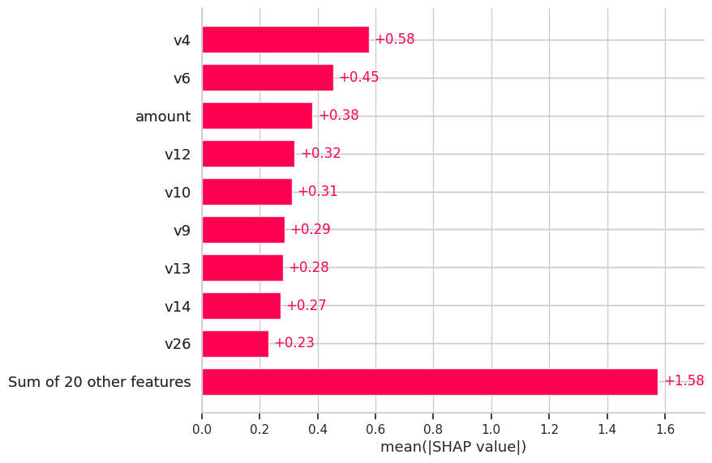
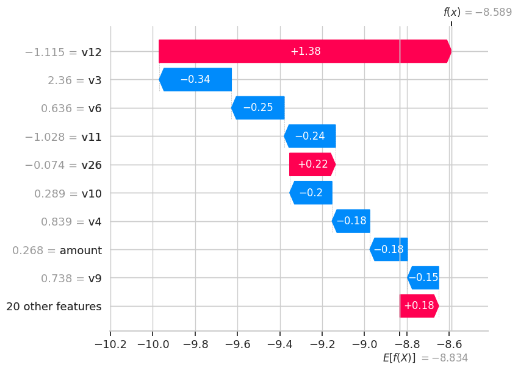
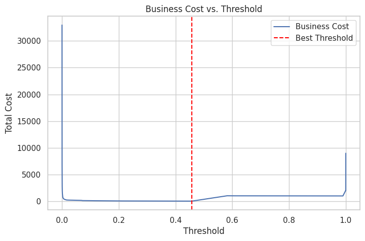

# 💳 Credit Card Fraud Detection (2023)

This project focuses on building robust machine learning models to detect fraudulent credit card transactions using real-world anonymized data from European cardholders in 2023.

## 📊 Dataset

- **Source**: [Kaggle - Credit Card Fraud Detection Dataset 2023](https://www.kaggle.com/datasets/nelgiriyewithana/credit-card-fraud-detection-dataset-2023)
- **Records**: 550,000+ transactions
- **Features**: 28 anonymized PCA components (`v1` ~ `v28`), `amount`, and `class` (0 = non-fraud, 1 = fraud)
- **Imbalance**: Highly imbalanced, < 0.1% fraud rate

---

## 🛠️ Tech Stack

- **Language**: Python 3
- **Libraries**: `scikit-learn`, `XGBoost`, `imbalanced-learn`, `SHAP`, `matplotlib`, `seaborn`
- **Techniques**:
  - SMOTE for imbalanced learning
  - Model evaluation: AUC, precision, recall, F1
  - SHAP for model explainability
  - Risk threshold tuning + business cost analysis

---

## 📈 Model Performance (Test Set)

### 1. Logistic Regression (SMOTE)
- **AUC**: 0.9986
- **Precision (fraud)**: 0.76
- **Recall (fraud)**: 0.87
- **F1-score (fraud)**: 0.81

### 2. Random Forest (SMOTE)
- **AUC**: 0.9998
- **Precision (fraud)**: 0.87
- **Recall (fraud)**: 0.87
- **F1-score (fraud)**: 0.87

### 3. XGBoost (SMOTE)
- **AUC**: 0.9998 ✅ *Best*
- **Precision (fraud)**: 0.74
- **Recall (fraud)**: 0.93
- **F1-score (fraud)**: 0.82

---

## 🔍 Model Explainability (SHAP)

- **Global SHAP Bar Plot**: Identified top features such as `v4`, `v6`, `amount`, `v12`, `v10` as most influential.
- **Local SHAP Waterfall**: Visualized feature contributions for individual fraud predictions.

<p align="center">
  
  <br/>
  
</p>

---

## 💰 Business Cost Analysis

- **Cost of False Positive (FP)**: $10
- **Cost of False Negative (FN)**: $1000
- **Optimal Threshold**: `0.458`
- **Minimum Cost**: `$50`

<p align="center">
  
</p>

---

## 📁 Project Structure

<pre> 📁 **Project Structure** ``` fraud-detection-2023/ │ ├── notebooks/ # Jupyter notebooks for EDA & model pipeline │ └── EDA_and_Modeling.ipynb │ ├── scripts/ # Python modules for modular training & evaluation │ ├── model_training.py │ ├── cost_analysis.py │ ├── shap_explainer.py │ └── data_load.py │ ├── assets/ # Visuals for README or reporting (e.g. SHAP, cost curve) │ └── [SHAP plot].png │ ├── requirements.txt # Python package dependencies └── README.md # Project overview, usage and results ``` </pre>
